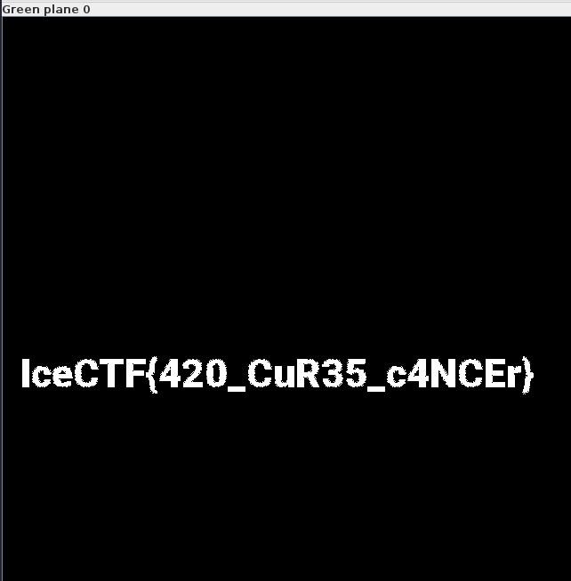

## 2021_9题目

#### 1.Web 粗心的小李


进入GitHack文件夹执行命令：

` python2 GitHack.py [网址].git/`下载文件


得到文件后，打开下载好的文件，打开index.html,在这里面找到flag


`flag`:n1book{git_looks_s0_easyfun}


#### 2.Crypto-Rotated

>观察题目可知本题为凯撒加密

` VprPGS{jnvg_bar_cyhf_1_vf_3?}`

使用[CTFCrackTools][https://github.com/0Chencc/CTFCrackTools] 可以直接解出

`flag`:JFRWKQ2UIZ5XOYLJORPW63TFL5YGY5LTL4YV62LTL4ZT67I=[^Base32Code编码]

#### 3.Misc-VapeNation

下载图片后使用Stegsolve.jar软件打开得到下面的图片，即可得到flag



#### 4.Misc-那些年我追过的贝丝

```
ZmxhZ3tpY3FlZHVfZ29nb2dvX2Jhc2U2NH0=
```

将上方字符进行Base64转码即可

